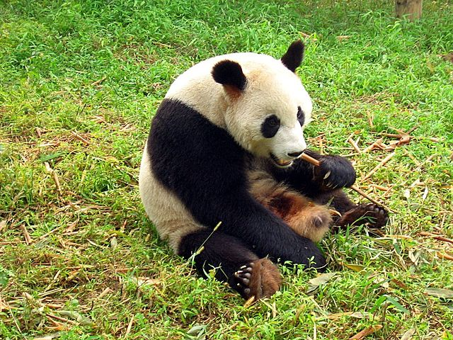

# Simple-kNN-model-animals

I wrote this code during my learning process. I was curious about how kNN algorithm will perform on this little datset. And the point is that I tested the model with train dataset itself. 

The dataset is consist of 7 images with 3 classes: dog, cat, panda. We can increase dataset size just downloading new pictures or with the help of data augmentation.

Some examples from dataset: 

  
  
  

I resized images, the normalized and added a dimension for model to accept it as a vector.
After training finished, I used same images to test. I the reuslt is model failed 2 times. It said cat to one of dogs and dog to one of pandas.
